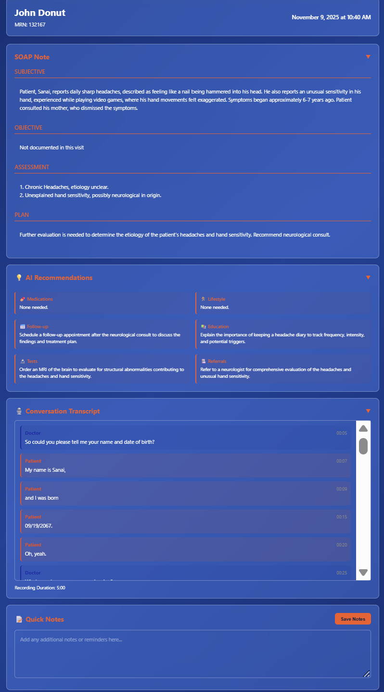

# UF Health SmartScribe

[](https://ufdreamteam.org)
[](LICENSE)
[](https://github.com)

> SmartScribe is an AI-powered medical scribe prototype that transforms doctor–patient conversations into structured SOAP notes — built during UF Dream Team’s 24-hour DESIGNATHON to help physicians spend more time with patients, not paperwork.

## About
UF Health SmartScribe is an intelligent documentation assistant designed to reduce administrative burden on healthcare providers. Using real‑time speech recognition + clinical AI processing, SmartScribe converts natural conversation into structured SOAP documentation automatically.

### Why SmartScribe Matters
Physicians lose hours everyday due to EHR typing + admin work. SmartScribe demonstrates how AI can return that time back to patient care instead of screen time. Instead of forcing physicians into rigid EHR workflows, SmartScribe aligns with a natural human conversation format — and the computer does the heavy structuring work in the background.

---

## Features (Expanded)
- Real-time recording/transcription (Deepgram)
- Speaker-aware clinical fact extraction (Gemini)
- Automatic SOAP note generation (S/O/A/P formatting layout)
- AI suggestions area (doctor-only visibility)
- Doctor manual notes + editing support
- Save finalized visit documentation to Supabase backend
- Patient dashboard (search / create / edit / delete patient)
- Past visit history viewing per patient profile

### How SmartScribe Works (Pipeline steps)
1) Doctor selects patient → start consultation  
2) Audio capture begins + real time STT transcription  
3) Transcript fed into AI → clinical facts extracted  
4) AI formats facts into structured SOAP draft  
5) Doctor edits or adds personal notes  
6) Finalized record saved securely to Supabase backend

---

## Tech Stack
| Layer | Tech |
|------|------|
| Frontend | HTML / CSS / vanilla JavaScript |
| Backend / Auth / DB | Supabase |
| Speech Transcription | Deepgram API |
| Clinical AI | Gemini API |
| Runtime | Node.js local dev server |

---
## Project Structure (High level)

```
uf-health-smartscribe/
│
├── index.html                      # Login page
├── consultation-view.html          # Recording interface for visits
├── patient-details.html            # Individual patient profile
├── signup.css                      # Signup page styles
├── login.css                       # Login page styles
├── patient-details.css             # Patient profile styles
├── .gitignore                      # Git ignore rules
├── .env                            # Environment variables (API keys)
├── package.json                    # Node.js dependencies
├── package-lock.json               # Dependency lock file
├── server.js                       # Local development server
├── PATIENTS_TABLE_SETUP.md         # Database schema documentation
├── SETUP.md                        # Setup instructions
├── README.md                       # This file
│
├── dashboard_screen/
│   ├── dashboard.html              # Patient list view
│   ├── documents.html              # Visit history/documents
│   ├── script.js                   # Dashboard logic
│   └── style.css                   # Dashboard styles
│
├── js/
│   ├── ai-summary.js               # AI SOAP note generation
│   ├── auth.js                     # Authentication logic
│   ├── deepgram-config.js          # DeepGram API configuration
│   ├── gemini-config.js            # Gemini API configuration
│   ├── medical-transcription.js    # Real-time transcription handler
│   ├── patient-details.js          # Patient CRUD operations
│   ├── signup.js                   # User registration
│   ├── supabase.js                 # Supabase client initialization
│   └── test-recording.html         # Audio recording test page
│
├── node_modules/                   # npm dependencies (auto-generated)
│
└── setup/                          # Setup scripts and configurations
```
---

## Getting Started

### Clone repo
```bash
git clone https://github.com/yourusername/uf-health-smartscribe.git
cd uf-health-smartscribe
```

### Install dependencies
```bash
npm install
```

### Configure API Keys (IMPORTANT)
You **must** replace keys in:

| File | API Key |
|------|---------|
| `/js/deepgram-config.js` | Deepgram API Key |
| `/js/gemini-config.js` | Gemini API Key |

The app will not run without your keys.

---

## Screenshots

| File | Consultation |
|----------|-------------|
|  |  |

---
## Deployment Status
Deployment not live yet — preparing prod deployment + secure env key handling.  
Current version runs locally only.

---

## Hackathon Story (compressed but expanded slightly)
SmartScribe was built at UF Dream Team’s DESIGNATHON — a nonprofit 24hr competition supporting kids at UF Health Shands Pediatric ICU.

**Prompt:** Optimize patient experience & save time in primary care settings.

We chose the core friction point: doctors spend too much time typing and not enough time talking. SmartScribe was designed within that framing so that AI takes the keyboard burden away, not the physician’s judgment.

This project represents how engineering + healthcare purpose can align into practical time-saving tooling.

---

## License
MIT License.
